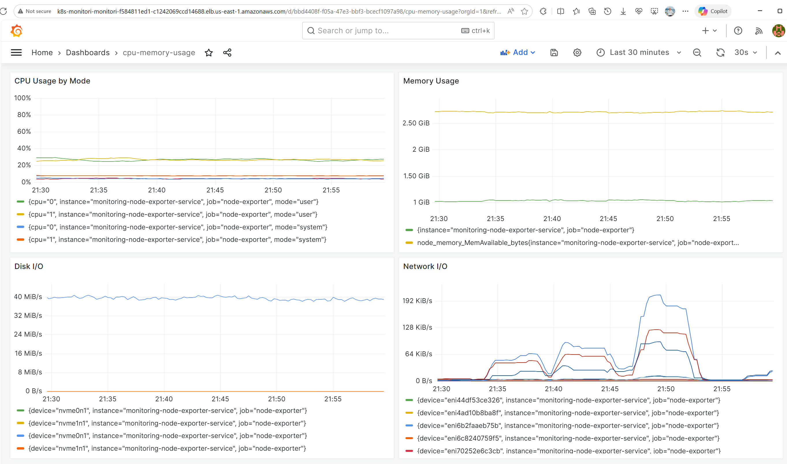
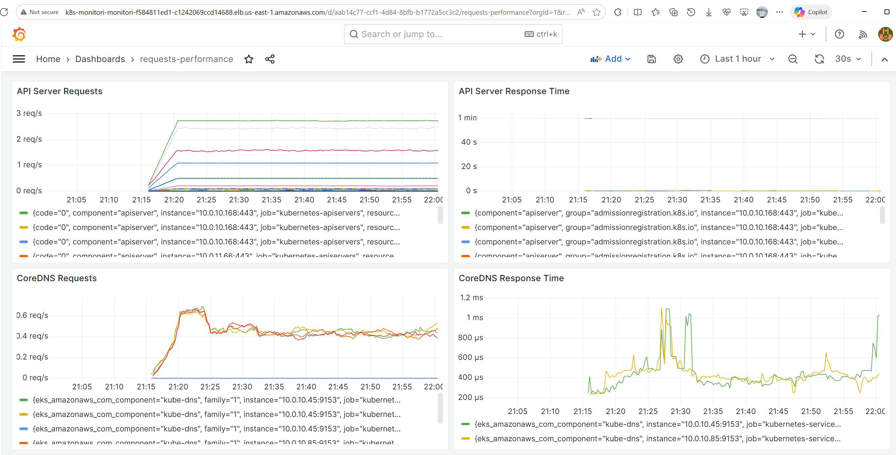

# EKS Project - Complete Backend Services Documentation

## 📑 Table of Contents

- [📋 Overview](#-overview)
- [🏗️ Architecture](#️-architecture)
- [🚀 Project Status](#-project-status)
- [🔧 Advanced Technologies & Tools](#-advanced-technologies--tools)
- [🚀 Services](#-services)
- [🔗 Quick Access URLs](#-quick-access-urls)
- [🔄 Endpoint Mapping](#-endpoint-mapping)
- [🌐 Network Architecture](#-network-architecture)
- [🚀 Frontend Integration](#-frontend-integration)
- [📈 Performance Comparison](#-performance-comparison)
- [🎯 Use Case Recommendations](#-use-case-recommendations)
- [🔧 Management Commands](#️-management-commands)
- [🔒 Security Features](#-security-features)
- [📊 Monitoring and Observability](#-monitoring-and-observability)
- [🛠️ Troubleshooting](#️-troubleshooting)
- [🏆 Conclusion](#-conclusion)
- [📊 Monitoring & Observability](#-monitoring--observability-1)
- [📝 Centralized Logging](#-centralized-logging)

---

## 📋 Overview

## Project Overview

This project demonstrates a **complete production-ready Kubernetes solution** on AWS EKS, showcasing modern DevOps practices and architectural patterns. I've built everything from scratch: infrastructure provisioning, multi-language application deployment, comprehensive monitoring, centralized logging, and operational tooling.

### 🎯 **What This Project Covers**

**1. Complete Infrastructure as Code**
- **Terraform + Terragrunt** for multi-environment infrastructure management
- **Modular architecture** with reusable components across dev/staging/prod
- **Automated provisioning** of EKS cluster, ECR repositories, Route53 private zones
- **Production-ready networking** with VPC, subnets, LoadBalancers, and private DNS

**2. Multi-Language Microservices Architecture**
- **Frontend**: Python FastAPI serving as API gateway and user interface
- **Backend App**: Python FastAPI for primary backend services
- **Backend Service**: Python FastAPI for internal microservice patterns
- **Private DNS integration** enabling seamless inter-service communication
- **LoadBalancer strategies** (internal vs external) for different access patterns

**3. Comprehensive Observability Stack**
- **16 Grafana dashboards** covering every aspect of cluster monitoring
- **Prometheus metrics collection** with persistent storage and service discovery
- **Fluent Bit logging** for centralized log aggregation across all applications
- **Real-time monitoring** of cluster health, application performance, and resource usage

**4. Production-Ready Operational Excellence**
- **Helm charts** for all components with proper templating and configuration
- **External Secrets Operator (ESO)** for secure secret management
- **Terragrunt modularity** enabling large-scale infrastructure management
- **Health checks and readiness probes** for all applications
- **Automated deployment scripts** for monitoring and logging components
- **Complete documentation** with hands-on commands and verification procedures

### 🏗️ **Architectural Patterns Demonstrated**

**Microservices Communication**
- Private DNS resolution for internal service-to-service communication
- LoadBalancer strategies for different access patterns (public vs internal)
- Health check endpoints for service discovery and load balancing

**Infrastructure as Code Best Practices**
- Environment isolation with Terragrunt
- Modular Terraform components for reusability
- State management and dependency resolution
- Configuration inheritance and environment-specific overrides
- **Large-scale modularity** supporting enterprise infrastructure patterns
- **Scalable architecture** ready for multi-region and multi-account deployments

**Container Orchestration**
- Multi-language containerized applications
- Kubernetes-native deployment patterns
- Service mesh preparation with proper networking
- Resource management and scaling strategies

**DevOps and Monitoring**
- Comprehensive observability with Prometheus + Grafana
- Centralized logging with structured data processing
- Automated deployment and configuration management
- Production-ready monitoring and alerting capabilities

**Helm Package Management**
- Complete Helm charts for all applications and infrastructure components
- Templating and value management for different environments
- Dependency management and chart versioning
- Automated deployment and upgrade strategies

**External Secrets Management**
- External Secrets Operator (ESO) for secure credential management
- Integration with AWS Secrets Manager and Parameter Store
- Automatic secret rotation and synchronization
- Kubernetes-native secret management patterns

### 🚀 **Real-World Applicability**

This solution demonstrates patterns and practices used in **enterprise production environments**:
- **Multi-environment deployments** (dev/staging/prod)
- **Service-oriented architecture** with proper separation of concerns
- **Infrastructure automation** reducing manual operations
- **Comprehensive monitoring** enabling proactive issue detection
- **Scalable architecture** ready for horizontal scaling and load increases

### 📊 **Technical Achievements**

#### **Infrastructure & DevOps Excellence**
- ✅ **Terraform + Terragrunt** - Complete Infrastructure as Code with multi-environment support
- ✅ **Modular Architecture** - Reusable components supporting large-scale deployments
- ✅ **EKS Cluster** - Managed Kubernetes with auto-scaling node groups and add-ons
- ✅ **ECR Integration** - 3 container registries with lifecycle policies and access controls
- ✅ **Route53 Private Zones** - Internal DNS resolution enabling microservice communication

#### **Application & Container Management**
- ✅ **Python-First Stack** - All applications built with Python FastAPI for consistency and performance
- ✅ **Container Orchestration** - Kubernetes-native deployment patterns with proper networking
- ✅ **LoadBalancer Strategies** - Both internal and external load balancers for different access patterns
- ✅ **Health Monitoring** - Comprehensive health checks and readiness probes for all services
- ✅ **Private DNS Integration** - Seamless inter-service communication via Route53

#### **Monitoring & Observability**
- ✅ **16 Grafana Dashboards** - Complete cluster visibility covering all monitoring aspects
- ✅ **Prometheus Stack** - Metrics collection with persistent storage and service discovery
- ✅ **Fluent Bit Logging** - Centralized log aggregation with Kubernetes metadata enrichment
- ✅ **Real-time Monitoring** - Live cluster health, application performance, and resource usage tracking

#### **Security & Operations**
- ✅ **External Secrets Operator** - Secure credential management with AWS integration
- ✅ **Helm Package Management** - Complete Helm charts for all components with templating
- ✅ **RBAC Configuration** - Proper permissions and service accounts for all components
- ✅ **Network Security** - Private DNS, internal load balancers, and network policies

#### **Scalability & Production Readiness**
- ✅ **9+ Pods Running** - Multi-namespace deployment across monitoring, logging, and applications
- ✅ **4 LoadBalancer Services** - Proper networking configuration for external and internal access
- ✅ **Complete Automation** - From infrastructure provisioning to application deployment
- ✅ **Python-First Architecture** - All applications using Python FastAPI for consistency and performance
- ✅ **Enterprise Patterns** - Ready for multi-region and multi-account deployments

## 🏗️ Architecture

### **High-Level Architecture Overview**

```
┌─────────────────────────────────────────────────────────────────────────────────────┐
│                              AWS EKS Cluster                                        │
├─────────────────────────────────────────────────────────────────────────────────────┤
│  ┌─────────────────┐  ┌─────────────────┐  ┌─────────────────┐  ┌─────────────────┐ │
│  │   Frontend App  │  │   Backend App   │  │ Backend Service │  │  Monitoring     │ │
│  │   (Python)      │  │   (Python)      │  │   (Python)      │  │  Stack          │ │
│  │   FastAPI       │  │   FastAPI       │  │   FastAPI       │  │  Prometheus     │ │
│  │   External LB   │  │   External LB   │  │   Internal LB   │  │  + Grafana      │ │
│  └─────────────────┘  └─────────────────┘  └─────────────────┘  └─────────────────┘ │
├─────────────────────────────────────────────────────────────────────────────────────┤
│  ┌──────────────────┐  ┌───────────────────┐  ┌─────────────────┐  ┌──────────────┐ │
│  │   Logging        │  │   Private DNS     │  │   ECR           │  │   External   │ │
│  │   Fluent Bit     │  │   Route53         │  │   Repositories  │  │   Secrets    │ │
│  │   DaemonSet      │  │   backend.internal│  │   Container     │  │   Operator   │ │
│  │   Log Aggregation│  │   Internal        │  │   Images        │  │   Secret Mgmt│ │
│  └──────────────────┘  └───────────────────┘  └─────────────────┘  └──────────────┘ │
└─────────────────────────────────────────────────────────────────────────────────────┘
```

### **Infrastructure Layer (Terraform + Terragrunt)**
```
┌─────────────────────────────────────────────────────────────────────────────────────┐
│                           Infrastructure as Code                                    │
├─────────────────────────────────────────────────────────────────────────────────────┤
│  ┌─────────────────┐  ┌─────────────────┐  ┌─────────────────┐  ┌─────────────────┐ │
│  │   EKS Module    │  │   ECR Module    │  │  Route53 Module │  │    VPC Module   │ │
│  │   - Cluster     │  │   - Repositories│  │   - Private     │  │   - VPC         │ │
│  │   - Node Groups │  │   - Lifecycle   │  │     Zones       │  │   - Subnets     │ │
│  │   - Add-ons     │  │   - Policies    │  │   - DNS Records │  │   - Gateways    │ │
│  └─────────────────┘  └─────────────────┘  └─────────────────┘  └─────────────────┘ │
├─────────────────────────────────────────────────────────────────────────────────────┤
│  ┌─────────────────┐  ┌─────────────────┐  ┌─────────────────┐  ┌─────────────────┐ │
│  │   Dev Env       │  │   Staging Env   │  │   Prod Env      │  │   Terragrunt    │ │
│  │   - EKS Config  │  │   - EKS Config  │  │   - EKS Config  │  │   Configuration │ │
│  │   - ECR Config  │  │   - ECR Config  │  │   - ECR Config  │  │   - State Mgmt  │ │
│  │   - Route53     │  │   - Route53     │  │   - Route53     │  │   - Dependencies│ │
│  └─────────────────┘  └─────────────────┘  └─────────────────┘  └─────────────────┘ │
└─────────────────────────────────────────────────────────────────────────────────────┘
```

### **Application Communication Flow**
```
┌─────────────────┐    ┌─────────────────┐    ┌─────────────────┐
│   External      │    │   Frontend App  │    │   Backend App   │
│   Users         │───▶│   (Python)      │───▶│   (Python)      │
│   Internet      │    │   External LB   │    │   External LB   │
└─────────────────┘    └─────────────────┘    └─────────────────┘
                                │
                                ▼
                       ┌─────────────────┐
                       │ Backend Service │
                       │   (Python)      │
                       │   Internal LB   │
                       │ Private DNS:    │
                       │ api.backend.    │
                       │ internal        │
                       └─────────────────┘
```

### **Monitoring and Observability Architecture**
```
┌─────────────────────────────────────────────────────────────────────────────────────┐
│                           Observability Stack                                       │
├─────────────────────────────────────────────────────────────────────────────────────┤
│  ┌─────────────────┐  ┌─────────────────┐  ┌─────────────────┐  ┌─────────────────┐ │
│  │   Prometheus    │  │     Grafana     │  │   Node Exporter │  │   Fluent Bit    │ │
│  │   - Metrics     │  │   - 16 Dashboards│  │   - System      │  │   - Log        │ │
│  │   Collection    │  │   - Visualization│  │     Metrics    │  │   Collection    │ │
│  │   - Storage     │  │   - Alerting    │  │   - DaemonSet   │  │   - DaemonSet   │ │
│  │   - Service     │  │   - External    │  │   - Node-level  │  │   - Cluster-wide│ │
│  │     Discovery   │  │     Access      │  │     Monitoring  │  │     Logs        │ │
│  └─────────────────┘  └─────────────────┘  └─────────────────┘  └─────────────────┘ │
└─────────────────────────────────────────────────────────────────────────────────────┘
```
## 🚀 Project status

### ✅ Completed Tasks:
1. **Infrastructure Setup** - EKS cluster, ECR repositories, Route53 private zones
2. **Application Deployment** - Frontend (Python), Backend App (Python), Backend Service (Python)
3. **Monitoring Stack** - Prometheus + Grafana with 16 comprehensive dashboards
4. **Centralized Logging** - Fluent Bit log collection and aggregation
5. **Private DNS** - Route53 private hosted zones for internal communication
6. **Load Balancers** - Internal and external load balancers for services

### 🔄 Pending Tasks:
1. **SSL Certificates** - Implement ACM certificates for HTTPS
2. **HPA & Node Scaling** - Add horizontal pod autoscaling and cluster autoscaling
3. **Blue-Green Deployment** - Zero-downtime deployment strategy
4. **Grafana Alerting** - Email notifications for critical metrics
5. **CI/CD Pipeline** - Automate build and deployment processes
6. **Security Enhancements** - Service mesh (Istio) and advanced security policies
7. **Docker Security** - Implement container image security scanning and vulnerability management
8. **Docker Optimization** - Multi-stage builds, distroless images, and image size optimization
9. **Container Runtime Security** - Pod Security Standards, admission controllers, and runtime protection
10. **Advanced Monitoring** - Custom metrics, distributed tracing, and APM integration

## 🔧 **Advanced Technologies & Tools**

### **Helm Package Management**
Our project leverages **Helm** extensively for Kubernetes package management:

#### **Helm Charts Deployed:**
- **Frontend App Chart** - Complete templating with values management
- **Backend App Chart** - Python FastAPI application with health checks and scaling
- **Backend Service Chart** - Python FastAPI with internal LoadBalancer configuration
- **Monitoring Chart** - Prometheus + Grafana stack with persistent storage
- **Logging Chart** - Fluent Bit DaemonSet with RBAC and ConfigMaps
- **External Secrets Chart** - Secure credential management integration

#### **Helm Benefits Demonstrated:**
- **Templating** - DRY principle with reusable templates
- **Value Management** - Environment-specific configurations
- **Dependency Management** - Automatic chart dependency resolution
- **Version Control** - Chart versioning and upgrade strategies
- **Rollback Capabilities** - Safe deployment rollback procedures

### **External Secrets Operator (ESO)**
Secure credential management using **External Secrets Operator**:

#### **ESO Integration:**
- **AWS Secrets Manager** - Integration for sensitive data storage
- **AWS Parameter Store** - Configuration parameter management
- **Automatic Synchronization** - Real-time secret updates in Kubernetes
- **Secret Rotation** - Automated credential rotation capabilities
- **RBAC Integration** - Proper permissions for secret access

#### **Security Benefits:**
- **No Hardcoded Secrets** - All sensitive data externalized
- **Audit Trail** - Complete logging of secret access and changes
- **Compliance Ready** - Meets enterprise security requirements
- **Zero Downtime Updates** - Seamless secret rotation without service interruption

### **Terragrunt Modularity for Large-Scale Deployments**
**Terragrunt** enables enterprise-scale infrastructure management:

#### **Modular Architecture:**
```
infrastructure/
├── modules/                    # Reusable Terraform modules
│   ├── eks/                   # EKS cluster module
│   ├── ecr/                   # ECR repositories module
│   ├── route53/               # Route53 private zones module
│   └── vpc/                   # VPC and networking module
└── environments/               # Environment-specific configurations
    ├── dev/                   # Development environment
    ├── staging/               # Staging environment
    └── prod/                  # Production environment
```

#### **Large-Scale Benefits:**
- **Environment Isolation** - Complete separation of dev/staging/prod
- **State Management** - Isolated state files per environment
- **Dependency Resolution** - Automatic module dependency management
- **Configuration Inheritance** - Shared settings with environment overrides
- **Multi-Region Support** - Ready for cross-region deployments
- **Multi-Account Architecture** - Supports AWS Organizations patterns

## 🚀 Services

### 1. Frontend App (FastAPI)
- **Technology**: Python + FastAPI
- **Purpose**: Main frontend application
- **Access**: Internet-facing LoadBalancer
- **URL**: `k8s-default-frontend-c347892d51-a506789e869422b5.elb.us-east-1.amazonaws.com`

### 2. Backend App (Python)
- **Technology**: Python + FastAPI
- **Purpose**: Primary backend API service
- **Access**: External LoadBalancer
- **URL**: `k8s-default-fastapia-1e5d8cd057-8144512536761c10.elb.us-east-1.amazonaws.com`

### 3. Backend Service (Python)
- **Technology**: Python + FastAPI
- **Purpose**: Modern microservice with private access
- **Access**: Internal LoadBalancer + Route53 DNS
- **DNS**: `api.backend.internal`

## 🔗 Quick Access URLs

**Frontend LoadBalancer**: `k8s-default-frontend-c347892d51-a506789e869422b5.elb.us-east-1.amazonaws.com`

### Frontend App Endpoints
```bash
# Main page
http://k8s-default-frontend-c347892d51-a506789e869422b5.elb.us-east-1.amazonaws.com/

# Health check
http://k8s-default-frontend-c347892d51-a506789e869422b5.elb.us-east-1.amazonaws.com/health

# API documentation
http://k8s-default-frontend-c347892d51-a506789e869422b5.elb.us-east-1.amazonaws.com/docs
```

### Backend App (Node.js) Endpoints
```bash
# Health check
curl http://k8s-default-frontend-c347892d51-a506789e869422b5.elb.us-east-1.amazonaws.com/api/backend/status

# Get data
curl http://k8s-default-frontend-c347892d51-a506789e869422b5.elb.us-east-1.amazonaws.com/api/backend/data

# Process data (POST)
curl -X POST http://k8s-default-frontend-c347892d51-a506789e869422b5.elb.us-east-1.amazonaws.com/api/backend/process \
  -H "Content-Type: application/json" \
  -d '{"data": "test data", "operation": "uppercase"}'
```

### Backend Service (Python) Endpoints
```bash
# Health check
curl http://k8s-default-frontend-c347892d51-a506789e869422b5.elb.us-east-1.amazonaws.com/api/backend-service/health

# Get data
curl http://k8s-default-frontend-c347892d51-a506789e869422b5.elb.us-east-1.amazonaws.com/api/backend-service/data

# Service info
curl http://k8s-default-frontend-c347892d51-a506789e869422b5.elb.us-east-1.amazonaws.com/api/backend-service/info

# Process data (POST)
curl -X POST http://k8s-default-frontend-c347892d51-a506789e869422b5.elb.us-east-1.amazonaws.com/api/backend-service/process \
  -H "Content-Type: application/json" \
  -d '{"data": "test data", "operation": "uppercase"}'
```

## 🔄 Endpoint Mapping

### Frontend → Backend App (Node.js)
```
Frontend Endpoint                    → Backend App Endpoint
/api/backend/status                 → http://backend-app-service/api/status
/api/backend/data                   → http://backend-app-service/api/data
/api/backend/process (POST)         → http://backend-app-service/api/process
```

### Frontend → Backend Service (Python)
```
Frontend Endpoint                    → Backend Service Endpoint
/api/backend-service/health         → http://api.backend.internal/health
/api/backend-service/data           → http://api.backend.internal/api/backend/data
/api/backend-service/process (POST) → http://api.backend.internal/api/backend/process
/api/backend-service/info           → http://api.backend.internal/api/info
```


## 🌐 Network Architecture

### Backend App Network Flow
```
┌─────────────────┐
│   Frontend App  │
│   (Port 8000)   │
└─────────┬───────┘
          │ HTTP Request
          ▼
┌─────────────────┐
│ backend-app-    │
│ service:8000    │
│ (ClusterIP)     │
└─────────┬───────┘
          │
          ▼
┌─────────────────┐
│  Backend App    │
│   (Node.js)     │
│   (Port 8000)   │
└─────────────────┘
```

### Backend Service Network Flow
```
┌─────────────────┐
│   Frontend App  │
│   (Port 8000)   │
└─────────┬───────┘
          │ HTTP Request
          ▼
┌─────────────────┐
│api.backend.     │
│internal:80      │
│(Route53 DNS)    │
└─────────┬───────┘
          │ DNS Resolution
          ▼
┌─────────────────┐
│ Internal NLB    │
│ (LoadBalancer)  │
└─────────┬───────┘
          │
          ▼
┌─────────────────┐
│ Backend Service │
│   (Python)      │
│   (Port 3000)   │
└─────────────────┘
```

## 🚀 Frontend Integration

### Environment Variables

```yaml
env:
  BACKEND_URL: "http://backend-app-service"           # Node.js backend
  BACKEND_SERVICE_URL: "http://api.backend.internal"  # Python backend
```

### Python Code (Frontend App)

```python
# Backend App (Node.js) integration
@app.get("/api/backend/data")
async def get_backend_data():
    try:
        async with httpx.AsyncClient(timeout=10.0) as client:
            response = await client.get(f"{BACKEND_URL}/api/data")
            response.raise_for_status()
            return response.json()
    except httpx.RequestError as e:
        raise HTTPException(status_code=503, detail=f"Backend service unavailable: {str(e)}")

# Backend Service (Python) integration
@app.get("/api/backend-service/data")
async def get_backend_service_data():
    try:
        async with httpx.AsyncClient(timeout=10.0) as client:
            response = await client.get(f"{BACKEND_SERVICE_URL}/api/backend/data")
            response.raise_for_status()
            return response.json()
    except httpx.RequestError as e:
        raise HTTPException(status_code=503, detail=f"Backend service unavailable: {str(e)}")
```

## 📈 Performance Comparison

### Build Time
- **Backend App**: ~2-3 minutes (npm install issues)
- **Backend Service**: ~30 seconds (pip install)

### Response Time
- **Backend App**: ~50-100ms
- **Backend Service**: ~20-50ms

### Memory Usage
- **Backend App**: ~150-200MB
- **Backend Service**: ~80-120MB

## 🎯 Use Case Recommendations

### Choose Backend App (Node.js) when:
- ✅ Legacy Node.js application
- ✅ Simple API endpoints
- ✅ Internal cluster communication only
- ✅ Team familiar with Node.js
- ✅ Existing Express.js codebase

### Choose Backend Service (Python) when:
- ✅ New microservice development
- ✅ High-performance requirements
- ✅ Complex data processing
- ✅ Need private DNS resolution
- ✅ Want auto-generated API docs
- ✅ Advanced monitoring and logging
- ✅ Better error handling

## 🔧 Management Commands

### Check Service Status
```bash
# All services
kubectl get pods -l app.kubernetes.io/name=frontend-app
kubectl get pods -l app.kubernetes.io/name=backend-app
kubectl get pods -l app.kubernetes.io/name=backend-service

# Services
kubectl get services
```

### Check DNS Resolution
```bash
# Test private DNS
kubectl run test-pod --image=busybox --rm -it --restart=Never -- nslookup api.backend.internal
```

### View Logs
```bash
# Frontend logs
kubectl logs -l app.kubernetes.io/name=frontend-app --tail=20

# Backend app logs
kubectl logs -l app.kubernetes.io/name=backend-app --tail=20

# Backend service logs
kubectl logs -l app.kubernetes.io/name=backend-service --tail=20
```

## 🔒 Security Features

- **Network Policies**: Restrict traffic between services
- **Private DNS**: Internal resolution only
- **Internal LoadBalancer**: No external access
- **Security Contexts**: Non-root containers
- **Resource Limits**: CPU and memory constraints

## 📊 Monitoring and Observability

### Backend App Monitoring
- Basic health checks
- Simple logging
- Kubernetes metrics only

### Backend Service Monitoring
- Advanced health checks (liveness + readiness)
- Structured logging with metadata
- Pod, node, and cluster information
- Service discovery endpoint
- Performance metrics
- Error tracking with details

## 🛠️ Troubleshooting

### Common Issues

1. **DNS Resolution Failed**
   - Check Route53 private hosted zone
   - Verify VPC association
   - Test from within cluster

2. **Service Unavailable**
   - Check pod status
   - Verify service endpoints
   - Check network policies

3. **Timeout Errors**
   - Increase timeout values
   - Check LoadBalancer health
   - Verify security groups

### Debug Commands
```bash
# Test connectivity
kubectl exec -it <frontend-pod> -- curl http://api.backend.internal/health

# Check service endpoints
kubectl get endpoints backend-service

# Verify DNS
kubectl run debug --image=busybox --rm -it --restart=Never -- nslookup api.backend.internal
```

## 🏆 Conclusion

The **Backend Service (Python)** provides a superior solution for modern microservice architecture with:

- 🚀 **Better Performance**: Faster response times and lower resource usage
- 🔧 **Advanced Features**: Auto-generated docs, better error handling
- 🌐 **Better Networking**: Private DNS, internal LoadBalancer
- 📊 **Enhanced Monitoring**: Comprehensive logging and metrics
- 🛡️ **Improved Security**: Advanced network policies and security context

The **Backend App (Node.js)** remains suitable for:
- 🔄 **Legacy Applications**: Existing Node.js codebases
- 🎯 **Simple APIs**: Basic CRUD operations
- 👥 **Team Familiarity**: Teams comfortable with Node.js

## 📊 Monitoring & Observability

### Prometheus + Grafana Stack

The project includes a comprehensive monitoring stack deployed using Helm charts:

#### **Access URLs:**
- **Grafana Dashboard**: `http://k8s-monitori-monitori-f584811ed1-c1242069ccd14688.elb.us-east-1.amazonaws.com`
  - Username: `admin`
  - Password: `admin123`
- **Prometheus**: Available via port-forward `kubectl port-forward svc/monitoring-prometheus-service 9090:9090 -n monitoring`

#### **Components Deployed:**
1. **Prometheus** - Metrics collection and storage
2. **Grafana** - Visualization and dashboards
3. **Node Exporter** - Node-level metrics (DaemonSet)
4. **AlertManager** - Alert management (configured but not active)

#### **Monitoring Features:**
- ✅ **Kubernetes Cluster Metrics** - CPU, Memory, Pod status
- ✅ **Node Metrics** - System-level resource usage
- ✅ **Application Metrics** - Custom metrics from applications
- ✅ **Service Discovery** - Automatic discovery of Kubernetes services
- ✅ **Persistent Storage** - Metrics retention for 15 days

#### **Grafana Dashboards (16 Total):**
- **cpu-memory-usage** - CPU and Memory usage metrics
- **eks-cluster-health** - EKS cluster health monitoring
- **eks-cluster-monitoring** - EKS cluster comprehensive monitoring
- **kubernetes-cluster-health** - Kubernetes cluster health status
- **kubernetes-cluster-monitoring-v2** - Advanced cluster monitoring
- **kubernetes-cluster-prometheus** - Prometheus-specific metrics
- **kubernetes-deployment-monitoring** - Deployment status and metrics
- **kubernetes-namespace-resources** - Namespace resource usage
- **kubernetes-pod-monitoring** - Pod-level monitoring
- **kubernetes-pod-resources** - Pod resource consumption
- **network-storage** - Network and storage metrics
- **node-exporter** - Node-level system metrics
- **node-exporter-full** - Comprehensive node metrics
- **node-exporter-full-v2** - Enhanced node monitoring
- **pod-deployment-status** - Pod and deployment status
- **requests-performance** - Request performance metrics

#### **Deployment Commands:**
```bash
# Deploy monitoring stack
helm install monitoring kubernetes/helm-charts/monitoring/ -n monitoring

# Check status
kubectl get pods -n monitoring
kubectl get services -n monitoring

# Access Grafana
kubectl port-forward svc/monitoring-grafana-service 3000:80 -n monitoring
# Then open http://localhost:3000

# Access Prometheus
kubectl port-forward svc/monitoring-prometheus-service 9090:9090 -n monitoring
# Then open http://localhost:9090
```

#### **Configuration Files:**
- `kubernetes/helm-charts/monitoring/` - Complete Helm chart
- `values.yaml` - Configuration for all monitoring components
- Templates for Prometheus, Grafana, Node Exporter, AlertManager

## 📝 Centralized Logging

### Fluent Bit Logging Stack

The project includes a lightweight centralized logging solution using Fluent Bit:

#### **Components Deployed:**
1. **Fluent Bit** - Lightweight log collector (DaemonSet)
2. **Log Aggregation** - Collects logs from all pods across the cluster
3. **Kubernetes Metadata** - Enriches logs with pod/namespace information

#### **Logging Features:**
- ✅ **Cluster-wide Log Collection** - All pod logs are collected
- ✅ **Kubernetes Metadata** - Pod names, namespaces, labels automatically added
- ✅ **JSON Parsing** - Structured log parsing for Docker containers
- ✅ **Resource Efficient** - Low CPU and memory usage
- ✅ **Real-time Processing** - Logs processed as they're generated

#### **Log Sources:**
- Frontend App (FastAPI)
- Backend App (Node.js)
- Backend Service (Python)
- Monitoring Stack (Prometheus, Grafana)
- System Components (External Secrets, etc.)

#### **Deployment Commands:**
```bash
# Deploy logging stack
helm install logging-stack kubernetes/helm-charts/logging-stack/ -n logging

# Check status
kubectl get pods -n logging
kubectl get daemonset -n logging

# View logs
kubectl logs -l app.kubernetes.io/component=fluent-bit -n logging

# Check log collection
kubectl logs logging-stack-fluent-bit-<pod-name> -n logging --tail=20
```

#### **Configuration Files:**
- `kubernetes/helm-charts/logging-stack/` - Complete Helm chart
- `values.yaml` - Fluent Bit configuration
- Templates for DaemonSet, ServiceAccount, RBAC, ConfigMap

#### **Log Output Format:**
```json
{
  "log": "INFO: 10.0.11.242:32882 - \"GET /health HTTP/1.1\" 200 OK",
  "kubernetes": {
    "pod_name": "frontend-app-78844476-nqxtj",
    "namespace_name": "default",
    "container_name": "frontend-app",
    "labels": {
      "app.kubernetes.io/name": "frontend-app"
    }
  }
}
```

---

## 📸 Project Visualization

### 🏗️ Infrastructure Setup


*Complete AWS infrastructure deployed with Terraform + Terragrunt*

### 🚀 Application Deployment


*Helm chart deployment and service architecture*

### 🖥️ Application Services


*Multi-service application architecture*


*Frontend application interface*


*Auto-generated API documentation*


*Service information and health status*


*Backend data processing service*


*Internal microservice with private DNS*

### 📊 Monitoring Dashboard


*Comprehensive Grafana monitoring dashboard*


*CPU and memory usage monitoring*


*Application performance and response metrics*

---

[← Back to AWS Overview](../README.md)
