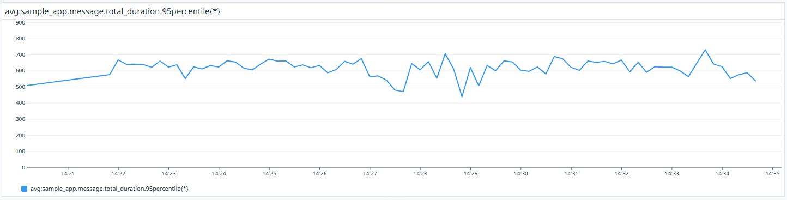
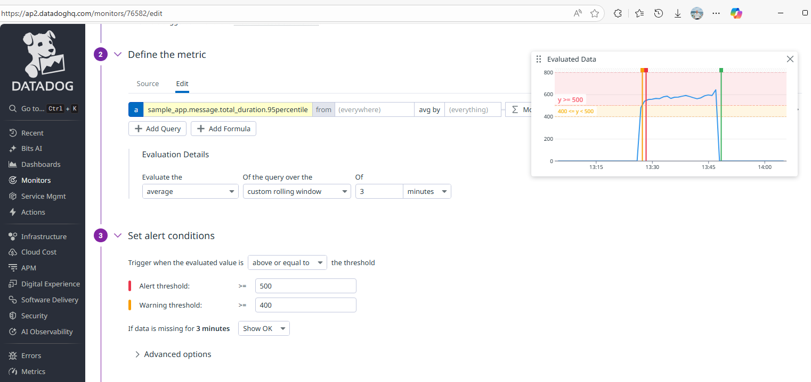

# Datadog Sample - AKS + Datadog APM Integration

Complete setup for Azure Kubernetes Service with Datadog monitoring and APM tracing.

## 📋 Overview

This project demonstrates:
- **Infrastructure**: Azure Kubernetes Service (AKS) with autoscaling and multiple node pools.
- **Monitoring**: Datadog Agent deployment for infrastructure metrics and logs.
- **APM**: Distributed tracing for a Go application using Datadog APM.
- **Custom Metrics**: DogStatsD integration for custom business metrics.
- **Application**: A sample Go web app with simulated workloads (DB, Storage, Queue).

## 🛠️ Prerequisites

Before you begin, ensure you have the following tools installed:

- **Azure CLI** (`az`): For managing Azure resources. [Install Guide](https://docs.microsoft.com/en-us/cli/azure/install-azure-cli)
- **Terraform** (`terraform`): For Infrastructure as Code. [Install Guide](https://learn.hashicorp.com/tutorials/terraform/install-cli)
- **Kubectl** (`kubectl`): Kubernetes command-line tool. [Install Guide](https://kubernetes.io/docs/tasks/tools/)
- **Helm** (`helm`): Package manager for Kubernetes. [Install Guide](https://helm.sh/docs/intro/install/)
- **Docker**: For building container images. [Install Guide](https://docs.docker.com/get-docker/)

You also need:
- An active **Azure Subscription**.
- A **Datadog Account** and API Key.

## 🏗️ Infrastructure Setup

The infrastructure is managed via Terraform in the `terraform/` directory.

### 1. Initialize and Apply Terraform

```bash
cd terraform

# Initialize Terraform
terraform init

# Review the plan
terraform plan

# Apply configuration (this will create AKS, ACR, etc.)
terraform apply
```

### 2. Configure kubectl

After Terraform completes, configure `kubectl` to connect to your new cluster:

```bash
az aks get-credentials --resource-group dd-sample-rg --name dd-sample-aks --file ~/.kube/config
```

## 🐶 Datadog Agent Setup

We use Helm to deploy the Datadog Agent.

### 1. Add Datadog Helm Repo

```bash
helm repo add datadog https://helm.datadoghq.com
helm repo update
```

### 2. Create Secret for API Key

Replace `<YOUR_DATADOG_API_KEY>` with your actual key.

```bash
kubectl create namespace datadog
kubectl create secret generic datadog-secret --from-literal api-key=<YOUR_DATADOG_API_KEY> -n datadog
```

### 3. Deploy Agent

```bash
helm install datadog datadog/datadog --namespace datadog -f helm/datadog/values.yaml
```

## 🚀 Application Deployment

The sample application is a Go web server located in the `app/` directory.

### 1. Build and Push Image

```bash
# Login to ACR (if needed)
az acr login --name datadogsampleacr

# Build and push
az acr build --registry datadogsampleacr --image sample-app:latest ./app
```

### 2. Deploy to Kubernetes

```bash
kubectl apply -f app/deployment.yaml
```

### 3. Verify Deployment

```bash
kubectl get pods -l app=sample-app
kubectl get svc sample-app
```

## 🧪 Testing & Usage

The application exposes several endpoints to demonstrate different APM features.

| Endpoint | Description | Metrics/Tracing |
|----------|-------------|-----------------|
| `/health` | Health check | Basic HTTP trace |
| `/hello` | Simple greeting | Custom span with tags |
| `/api/data` | Database simulation | DB query tracing, error simulation |
| `/api/message` | Queue simulation | 3-step process (DB, Storage, Queue) with **Custom Metrics** |
| `/slow` | Slow response | Performance profiling |
| `/error` | Error response | Error tracking and alerting |

### Example Requests

```bash
export APP_IP=$(kubectl get svc sample-app -o jsonpath='{.status.loadBalancer.ingress[0].ip}')

# Test basic endpoint
curl http://$APP_IP/hello?name=Datadog

# Test custom metrics flow
curl http://$APP_IP/api/message
```

## 📊 Monitoring & APM

### Distributed Tracing
Go to **[Datadog APM > Traces](https://ap2.datadoghq.com/apm/traces)** and filter by `service:sample-app`. You will see traces for each request, including spans for simulated DB and Storage calls.

### Custom Metrics (DogStatsD)
The `/api/message` endpoint publishes custom metrics. You can visualize them in a Datadog Dashboard.

**Key Metrics:**
- `sample_app.message.total_duration` (Histogram): Total processing time.
- `sample_app.message.step1_db_duration` (Histogram): Time spent in DB step.
- `sample_app.message.step2_storage_duration` (Histogram): Time spent in Storage step.
- `sample_app.message.step3_queue_duration` (Histogram): Time spent in Queue step.
- `sample_app.message.success` (Counter): Number of successful requests.

**Note:** When visualizing, ensure you use the correct metric type (e.g., `avg` for duration, `count` or `rate` for counters).

### Visual Walkthrough

Below are screenshots showing the Datadog monitoring setup:

#### 1. Datadog Overview Page
The main overview page displays your metric sources, including both standard and custom metrics collected from the AKS cluster and applications.


#### 2. Custom Metrics Browser
Browse and explore all custom metrics that are published from your applications via DogStatsD.


#### 3. Dashboard - Average Metrics
Dashboard visualizing custom metrics using average aggregation, showing typical performance patterns.


#### 4. Dashboard - Percentile Metrics
Dashboard visualizing custom metrics using P95 percentile, useful for identifying outliers and tail latencies.



#### 5. Alert Configuration
Configure alerts based on custom metrics to get notified when thresholds are exceeded.



## 📉 Load Testing

A script is provided to generate load and populate your dashboards.

```bash
# Run 1000 requests
./scripts/load_test.sh 1000
```
