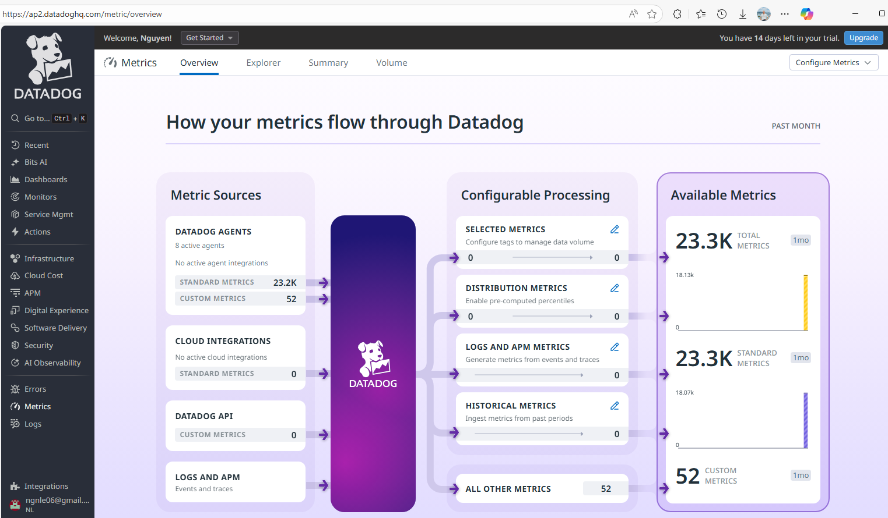
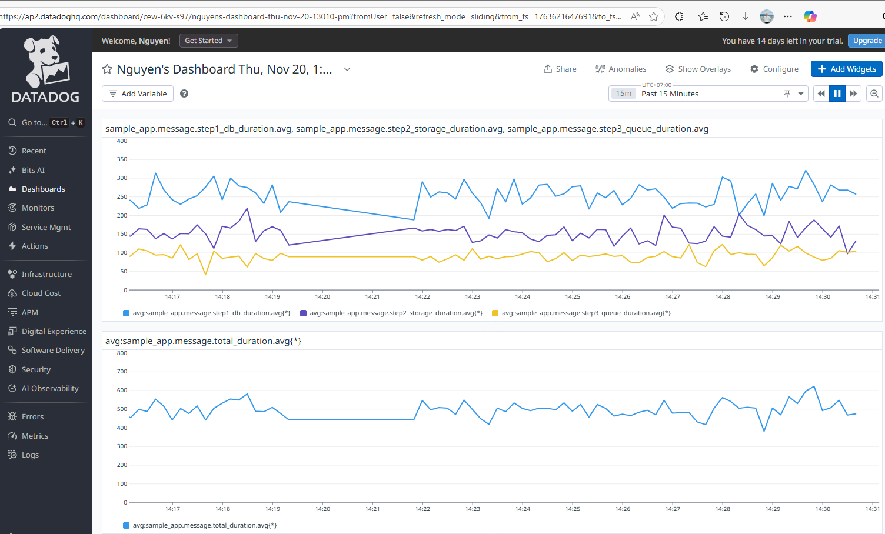
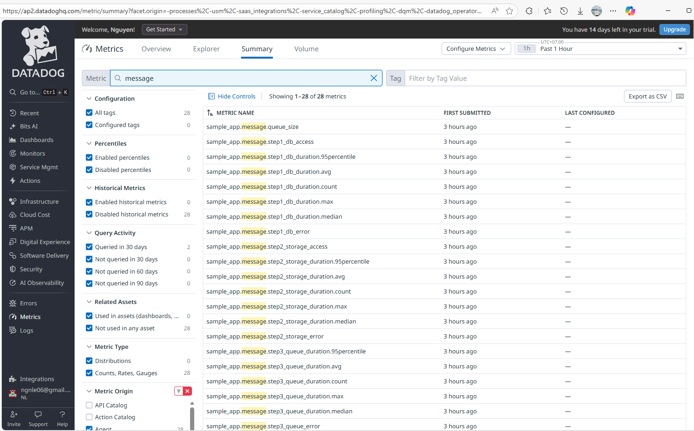
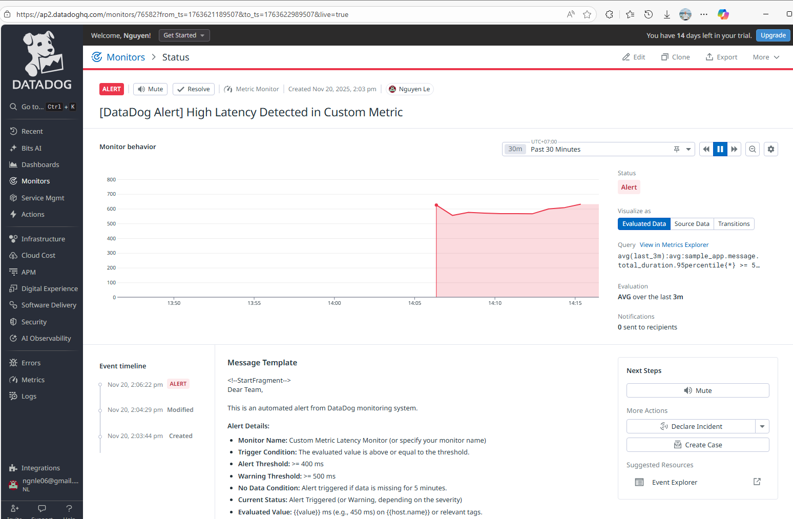

# Datadog Sample - Multi-Cloud APM Integration

A comprehensive demonstration of **Datadog APM (Application Performance Monitoring)** and observability across multiple cloud platforms, showcasing infrastructure monitoring, distributed tracing, and custom metrics.

## 📋 Overview

This repository contains **two complete implementations** of a sample Go application with Datadog integration, deployed on different cloud platforms:

1. **[Azure Kubernetes Service (AKS)](./aks/README.md)** - Container orchestration with Kubernetes
2. **[AWS ECS Fargate](./ecs/README.md)** - Serverless container platform

Both implementations demonstrate identical Datadog capabilities with platform-specific deployment patterns.

---

## 🎯 Features Demonstrated

### Datadog APM & Observability
- ✅ **Distributed Tracing** - End-to-end request tracing across services
- ✅ **Custom Metrics (DogStatsD)** - Business and performance metrics
- ✅ **Infrastructure Monitoring** - Real-time resource utilization
- ✅ **Log Management** - Centralized log aggregation and analysis
- ✅ **Error Tracking** - Automatic error detection and alerting
- ✅ **Performance Profiling** - CPU, memory, and latency analysis

### Application Features
The sample Go application provides multiple endpoints to showcase different APM capabilities:

| Endpoint | Description | APM Features |
|----------|-------------|--------------|
| `/health` | Health check | Basic HTTP trace |
| `/hello` | Simple greeting | Custom spans with tags |
| `/api/data` | Database simulation | DB query tracing, error simulation |
| `/api/message` | Queue simulation | Multi-step tracing (DB → Storage → Queue) + Custom Metrics |
| `/slow` | Slow response | Performance profiling, latency tracking |
| `/error` | Error response | Error tracking and alerting |

---

## 🏗️ Solution 1: Azure Kubernetes Service (AKS)



### Architecture
- **Platform**: Azure Kubernetes Service (AKS)
- **Container Registry**: Azure Container Registry (ACR)
- **Infrastructure**: Terraform-managed resources
- **Datadog Agent**: Deployed via Helm chart
- **Scaling**: Cluster autoscaler with multiple node pools

### Key Components
- **AKS Cluster** with autoscaling capabilities
- **Datadog Agent** deployed as DaemonSet
- **APM Instrumentation** in Go application
- **DogStatsD** for custom metrics
- **Load Balancer** for external access

### Quick Start

```bash
cd aks

# 1. Deploy infrastructure
cd terraform
terraform init
terraform apply

# 2. Configure kubectl
az aks get-credentials --resource-group dd-sample-rg --name dd-sample-aks

# 3. Deploy Datadog Agent
kubectl create namespace datadog
kubectl create secret generic datadog-secret --from-literal api-key=<YOUR_API_KEY> -n datadog
helm install datadog datadog/datadog --namespace datadog -f helm/datadog/values.yaml

# 4. Build and deploy application
az acr build --registry datadogsampleacr --image sample-app:latest ./app
kubectl apply -f app/deployment.yaml

# 5. Test the application
./scripts/load_test.sh 1000
```

### Highlights
- **Kubernetes-native** deployment with Helm charts
- **Automatic service discovery** for containers
- **Horizontal Pod Autoscaler** (HPA) for application scaling
- **Cluster autoscaler** for node scaling
- Full **Kubernetes metrics** and events in Datadog

📖 **[Full AKS Documentation →](./aks/README.md)**

---

## 🏗️ Solution 2: AWS ECS Fargate


### Architecture
- **Platform**: AWS ECS Fargate (Serverless containers)
- **Container Registry**: Amazon ECR
- **Infrastructure**: Terraform-managed resources
- **Datadog Agent**: Sidecar container pattern
- **Load Balancing**: Application Load Balancer (ALB)

### Key Components
- **ECS Cluster** with Fargate launch type
- **Datadog Agent** as sidecar container
- **APM Instrumentation** in Go application (same as AKS)
- **DogStatsD** for custom metrics
- **Application Load Balancer** for traffic distribution

### Quick Start

```bash
cd ecs

# 1. Deploy infrastructure with Datadog API key
cd terraform
export TF_VAR_datadog_api_key=<YOUR_API_KEY>
terraform init
terraform apply

# Note the outputs: ecr_repository_url and alb_dns_name

# 2. Build and push application image
aws ecr get-login-password --region ap-southeast-1 | \
    docker login --username AWS --password-stdin <ECR_REPO_URL>

docker build -t <ECR_REPO_URL>:latest ../app
docker push <ECR_REPO_URL>:latest

# 3. Force deployment update
aws ecs update-service \
    --cluster datadog-sample-ecs-cluster \
    --service datadog-sample-ecs-service \
    --force-new-deployment

# 4. Test the application
curl http://<ALB_DNS_NAME>/health
./scripts/load_test.sh 1000
```

### Highlights
- **Serverless containers** with no server management
- **Sidecar pattern** for Datadog Agent deployment
- **Automatic scaling** based on CPU/memory metrics
- **VPC networking** with public/private subnets
- **CloudWatch** integration alongside Datadog

📖 **[Full ECS Documentation →](./ecs/README.md)**

---

## 📊 Datadog Dashboards & Monitoring

Both solutions provide identical observability data in Datadog:

### APM Traces
View distributed traces in **[Datadog APM](https://ap2.datadoghq.com/apm/traces)**:
- Filter by `service:sample-app` (AKS) or `service:datadog-sample-ecs` (ECS)
- Analyze request latency, errors, and throughput
- Inspect individual traces with span-level details



### Custom Metrics
The `/api/message` endpoint publishes business metrics via DogStatsD:

- `sample_app.message.total_duration` - Total processing time (histogram)
- `sample_app.message.step1_db_duration` - Database operation time (histogram)
- `sample_app.message.step2_storage_duration` - Storage operation time (histogram)
- `sample_app.message.step3_queue_duration` - Queue operation time (histogram)
- `sample_app.message.success` - Success counter (count)



### Code Example: Duration Tracking & Metrics Publishing

Here's how the application calculates and publishes custom metrics for each step of the message handling process:

```go
// Initialize DogStatsD client
metricsClient, err := statsd.New(statsdAddr,
    statsd.WithNamespace("sample_app."),
    statsd.WithTags([]string{
        "env:dev",
        "service:sample-app",
    }),
)

// Main message handler with total duration tracking
func messageQueueHandler(w http.ResponseWriter, r *http.Request) {
    span, ctx := tracer.StartSpanFromContext(r.Context(), "message.handler")
    defer span.Finish()

    // Track total processing time
    totalStart := time.Now()

    // Step 1: Database access
    dbData, err := accessDBForMessage(ctx)
    if err != nil {
        // Handle error
        return
    }

    // Step 2: Storage access
    storageData, err := accessStorage(ctx)
    if err != nil {
        // Handle error
        return
    }

    // Step 3: Queue message send
    messageID, err := sendMessageToQueue(ctx, dbData, storageData)
    if err != nil {
        // Handle error
        return
    }

    // Calculate and publish total processing time
    totalDuration := time.Since(totalStart)
    
    // Publish metrics to Datadog
    if metricsClient != nil {
        metricsClient.Timing("message.total_duration", totalDuration, nil, 1)
        metricsClient.Incr("message.success", nil, 1)
    }

    span.SetTag("total_duration_ms", totalDuration.Milliseconds())
    w.WriteHeader(http.StatusOK)
}

// Individual step with duration tracking (Step 1: Database)
func accessDBForMessage(ctx context.Context) (string, error) {
    span, _ := tracer.StartSpanFromContext(ctx, "db.access_for_message")
    defer span.Finish()

    // Track step duration
    stepStart := time.Now()

    // Simulate database operation (100-400ms)
    time.Sleep(time.Duration(rand.Intn(300)+100) * time.Millisecond)

    // Calculate step duration
    stepDuration := time.Since(stepStart)

    // Publish step-specific metrics
    if metricsClient != nil {
        metricsClient.Timing("message.step1_db_duration", stepDuration, nil, 1)
        metricsClient.Incr("message.step1_db_access", nil, 1)
    }

    span.SetTag("step_duration_ms", stepDuration.Milliseconds())
    return "DB_DATA", nil
}

// Step 2: Storage access with metrics
func accessStorage(ctx context.Context) (string, error) {
    stepStart := time.Now()
    
    // Simulate storage operation (50-250ms)
    time.Sleep(time.Duration(rand.Intn(200)+50) * time.Millisecond)
    
    stepDuration := time.Since(stepStart)
    
    // Publish metrics
    if metricsClient != nil {
        metricsClient.Timing("message.step2_storage_duration", stepDuration, nil, 1)
        metricsClient.Incr("message.step2_storage_access", nil, 1)
    }
    
    return "STORAGE_DATA", nil
}

// Step 3: Queue send with metrics
func sendMessageToQueue(ctx context.Context, dbData, storageData string) (string, error) {
    stepStart := time.Now()
    
    // Simulate queue operation (30-150ms)
    time.Sleep(time.Duration(rand.Intn(120)+30) * time.Millisecond)
    
    stepDuration := time.Since(stepStart)
    messageID := fmt.Sprintf("MSG_%d", time.Now().UnixNano())
    
    // Publish metrics
    if metricsClient != nil {
        metricsClient.Timing("message.step3_queue_duration", stepDuration, nil, 1)
        metricsClient.Incr("message.step3_queue_send", nil, 1)
        metricsClient.Gauge("message.queue_size", float64(len(dbData+storageData)), nil, 1)
    }
    
    return messageID, nil
}
```

**Key Points:**
- ⏱️ **`time.Now()`** captures the start time for each step
- 📊 **`time.Since()`** calculates the duration by comparing with start time
- 📈 **`metricsClient.Timing()`** publishes histogram metrics (duration)
- 🔢 **`metricsClient.Incr()`** increments counters (operation count)
- 📏 **`metricsClient.Gauge()`** sets gauge metrics (current value)
- 🏷️ **Span tags** provide correlation between traces and metrics

**Metrics Flow:**
```
/api/message request
  ├─ Step 1: DB Access (100-400ms)
  │   └─ Publishes: step1_db_duration, step1_db_access
  ├─ Step 2: Storage Access (50-250ms)
  │   └─ Publishes: step2_storage_duration, step2_storage_access
  ├─ Step 3: Queue Send (30-150ms)
  │   └─ Publishes: step3_queue_duration, step3_queue_send, queue_size
  └─ Total Duration (180-800ms)
      └─ Publishes: total_duration, success
```

### Alerting
Configure alerts based on:
- Error rate thresholds
- P95/P99 latency
- Custom metric anomalies
- Infrastructure resource utilization



---

## 🆚 Comparison: AKS vs ECS

| Feature | AKS (Kubernetes) | ECS Fargate |
|---------|------------------|-------------|
| **Orchestration** | Kubernetes | AWS ECS |
| **Container Runtime** | containerd | Fargate (AWS-managed) |
| **Datadog Agent Deployment** | DaemonSet (via Helm) | Sidecar container |
| **Infrastructure Management** | Node pools, manual/auto scaling | Fully serverless, automatic |
| **Networking** | K8s Services, Ingress | ALB, Target Groups |
| **Scaling** | HPA + Cluster Autoscaler | ECS Service Auto Scaling |
| **Complexity** | Higher (Kubernetes learning curve) | Lower (managed service) |
| **Cost Model** | Pay for nodes (VMs) | Pay per task (CPU/memory) |
| **Best For** | Complex microservices, multi-cloud | Simplified operations, AWS-native |

---

## 🛠️ Prerequisites

### Common Requirements
- **Datadog Account** with API key ([Sign up](https://www.datadoghq.com/))
- **Docker** for building images
- **Terraform** for infrastructure provisioning
- **Git** for version control

### AKS-Specific
- **Azure CLI** (`az`)
- **kubectl** - Kubernetes CLI
- **Helm** - Kubernetes package manager
- **Azure Subscription**

### ECS-Specific
- **AWS CLI** (configured with credentials)
- **AWS Account** with appropriate permissions

---

## 🧪 Load Testing

Both solutions include a load testing script to generate traffic:

```bash
# Generate 1000 requests to populate Datadog dashboards
./scripts/load_test.sh 1000
```

This script will:
- Hit all endpoints to generate diverse traces
- Create custom metrics data
- Simulate errors for error tracking
- Generate slow requests for performance analysis

---

## 📁 Repository Structure

```
.
├── aks/                          # Azure Kubernetes Service implementation
│   ├── app/                      # Go application source code
│   │   ├── main.go               # APM instrumented Go app
│   │   ├── Dockerfile            # Container image definition
│   │   └── deployment.yaml       # Kubernetes manifest
│   ├── helm/                     # Helm charts
│   │   └── datadog/              # Datadog Agent configuration
│   ├── terraform/                # AKS infrastructure (Terraform)
│   ├── scripts/                  # Utility scripts
│   ├── images/                   # Documentation screenshots
│   └── README.md                 # AKS-specific documentation
│
├── ecs/                          # AWS ECS Fargate implementation
│   ├── app/                      # Same Go application, ECS-ready
│   │   ├── main.go               # APM instrumented Go app
│   │   └── Dockerfile            # Container image definition
│   ├── terraform/                # ECS infrastructure (Terraform)
│   │   └── main.tf               # VPC, ALB, ECS, ECR, Tasks
│   ├── scripts/                  # Utility scripts
│   ├── images/                   # Documentation screenshots
│   └── README.md                 # ECS-specific documentation
│
├── .gitignore                    # Git ignore patterns
└── README.md                     # This file
```

---

## 🎓 Learning Objectives

This repository demonstrates how to:

1. **Instrument a Go application** with Datadog APM libraries
2. **Deploy Datadog Agent** in different environments (K8s vs ECS)
3. **Collect custom metrics** using DogStatsD
4. **Configure distributed tracing** for microservices
5. **Set up infrastructure monitoring** for cloud resources
6. **Implement infrastructure as code** with Terraform
7. **Compare cloud platforms** for container workloads

---

## 🤝 Contributing

This is a sample/demo repository. Feel free to:
- Fork and adapt for your use case
- Extend with additional cloud platforms (GCP GKE, Azure Container Apps, etc.)
- Add more observability features (RUM, Synthetics, etc.)

---

## 📝 License

This project is provided as-is for educational and demonstration purposes.

---

## 🔗 Resources

### Datadog Documentation
- [APM Getting Started](https://docs.datadoghq.com/tracing/)
- [DogStatsD](https://docs.datadoghq.com/metrics/dogstatsd_metrics_submission/)
- [Kubernetes Integration](https://docs.datadoghq.com/integrations/kubernetes/)
- [ECS Integration](https://docs.datadoghq.com/integrations/ecs_fargate/)
- [Go APM Library](https://docs.datadoghq.com/tracing/setup_overview/setup/go/)

### Cloud Platform Documentation
- [Azure Kubernetes Service (AKS)](https://docs.microsoft.com/en-us/azure/aks/)
- [AWS ECS Fargate](https://docs.aws.amazon.com/AmazonECS/latest/developerguide/AWS_Fargate.html)
- [Terraform Azure Provider](https://registry.terraform.io/providers/hashicorp/azurerm/latest/docs)
- [Terraform AWS Provider](https://registry.terraform.io/providers/hashicorp/aws/latest/docs)

---

## 💡 Next Steps

1. **Choose your platform**: Start with [AKS](./aks/README.md) or [ECS](./ecs/README.md)
2. **Deploy the infrastructure**: Follow the platform-specific README
3. **Explore Datadog**: Check traces, metrics, and logs in your Datadog account
4. **Customize**: Adapt the application and monitoring to your needs
5. **Scale**: Test autoscaling and see how Datadog handles increased load
