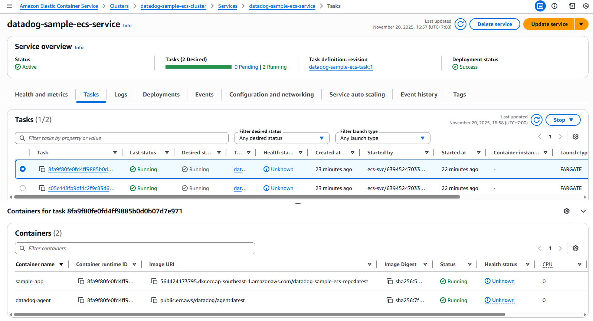
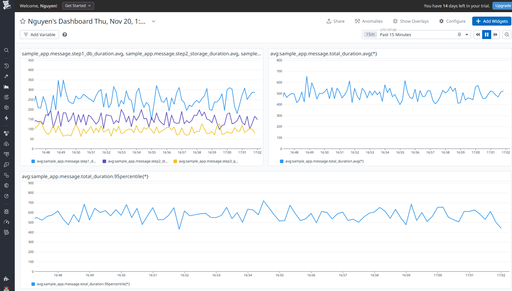

# Datadog Sample - ECS Fargate + Datadog APM Integration

This directory contains the AWS ECS Fargate implementation of the Datadog Sample App.

## 🏗️ Infrastructure Setup

The infrastructure is managed via Terraform in the `terraform/` directory.

### Prerequisites
- AWS CLI configured with appropriate permissions.
- Terraform installed.
- Datadog API Key.

### 1. Deploy Infrastructure

```bash
cd terraform

# Set Datadog API Key
export TF_VAR_datadog_api_key=<YOUR_DATADOG_API_KEY>

# Initialize and Apply
terraform init
terraform apply
```

Note the outputs: `ecr_repository_url` and `alb_dns_name`.

## 🚀 Application Deployment

### 1. Build and Push Image

Replace `<ECR_REPO_URL>` with the value from Terraform output.

```bash
# Login to ECR
aws ecr get-login-password --region ap-southeast-1 | docker login --username AWS --password-stdin <ECR_REPO_URL>

# Build Image
docker build -t <ECR_REPO_URL>:latest ../app

# Push Image
docker push <ECR_REPO_URL>:latest
```

### 2. Update Service

If the service is already running, force a new deployment to pick up the new image:

```bash
aws ecs update-service --cluster datadog-sample-ecs-cluster --service datadog-sample-ecs-service --force-new-deployment
```

## 🧪 Testing

Access the application using the ALB DNS Name:

```bash
curl http://<ALB_DNS_NAME>/health
curl http://<ALB_DNS_NAME>/hello?name=ECS
curl http://<ALB_DNS_NAME>/api/message

./scripts/load_test.dh 1000
```

## 📊 Monitoring

Go to Datadog and filter by `service:datadog-sample-ecs` (or whatever you configured in variables). You should see traces and metrics similar to the AKS version.

### Visual Walkthrough

Below are screenshots showing the Datadog monitoring setup for ECS Fargate:

#### 1. ECS Overview
The ECS infrastructure view in Datadog, showing your Fargate tasks, services, and container metrics.



#### 2. Dashboard
Dashboard visualizing application metrics and traces from the ECS Fargate deployment, including APM traces and custom metrics.


